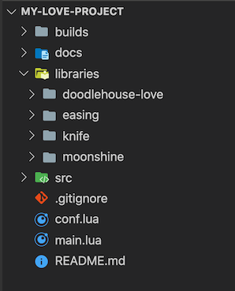

# love-structure
Initial project structure for love2d project

After making a couple small love2d prototypes, this structure seemed to emerge. So I wrote this small script to automate the process of getting started.

## What does it do exactly?
Creates a simple project folder structure
Pulls in a couple common libraries that I've found useful
Creates a git repo for the project
Creates the initial files: main, conf, todo, readme and gitignore

## How use
1. Make sure you have [git](https://git-scm.com) and [python3](https://www.python.org/downloads/) installed 

2. Clone the repo into a folder on your computer, somewhere like:

    `Users/<yourName>/scripts`

3. cd into the folder in the terminal and clone this repo by typing:

    `git clone https://github.com/Pomb/love-structure.git`

4. Add the folder to the path in your .zshrc or .bashrc script

    `export PATH=$HOME/scripts/love-structure:$PATH`

5. Allow calling the script straight from the terminal

    `sudo chmod a+x /Users/<name>/scripts/myscript.py`

6. Run the script by typing:

    `love-structure.py <name-of-your-game>`